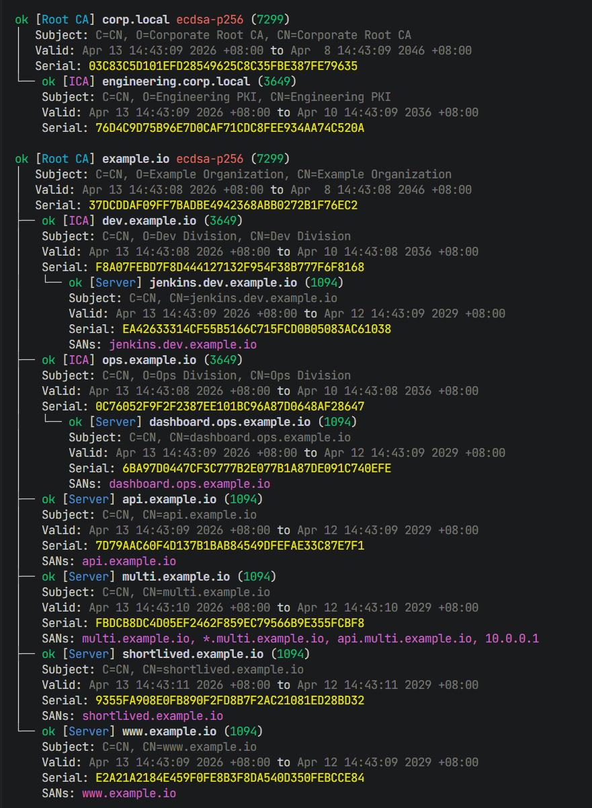

# certboy

Certboy is a Rust CLI for managing a local PKI:

- Root CA (self-signed)
- Intermediate CA (issued by a Root CA)
- TLS/server certificates (issued by Root CA or ICA)



## Disclaimer

This project is just a POC for my personal study and homelab. DO NOT SUGGEST USING FOR PRODUCTION.
certboy stores everything in a single “context” directory and provides utilities for creating, inspecting, exporting, importing, renewing, and revoking certificates.

## Default Context

- Default: `~/.local/state/certboy` (or `$XDG_STATE_HOME/certboy`)
- Override: `--context <path>`
- Env override: `CERTBOY_CONTEXT`

## Key Algorithm

- Root CA key algorithm defaults to ECDSA P-256.
- The algorithm is written to `meta.json` and all ICAs/TLS certificates under that Root CA inherit it.

## Install

Build from source:

```bash
cargo build --release
sudo cp target/release/certboy /usr/local/bin/
```

## Quickstart

```bash
./scripts/quickstart.sh
```

## Common Examples

Initialize a Root CA:

```bash
certboy --domain example.com --cn ExampleOrg --root-ca
```

Initialize a Root CA with RSA:

```bash
certboy --domain example.com --cn ExampleOrg --root-ca --key-algorithm rsa
```

Create an Intermediate CA:

```bash
certboy --domain ops.example.com --ca example.com --cn Ops.ExampleOrg
```

Issue a TLS certificate (single domain):

```bash
certboy --ca example.com -d auth.example.com
```

Issue a TLS certificate with multiple SANs (positional args are merged with `-d/--domain`):

```bash
certboy --ca ops.example.com docs.ops.example.com docs1.ops.example.com '*.ops.example.com' 127.0.0.1
```

Check certificates:

```bash
certboy check
certboy check --detail
certboy check --renew
```

## Environment Variables

- `LOGLEVEL`: default log level (`trace|debug|info|warn|error`)
- `CERTBOY_CONTEXT`: default context path (equivalent to `--context`)
- `CERTM_CONTEXT`: legacy fallback
- `BW_MKCERT_CONTEXT`: legacy fallback

## Development

```bash
cargo fmt
cargo test
```
