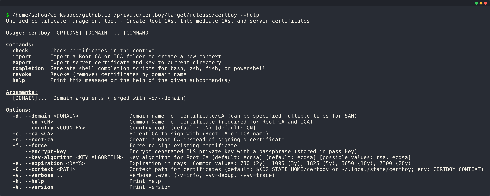
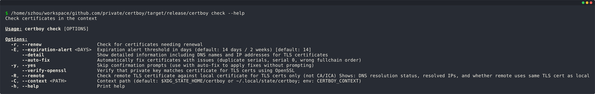
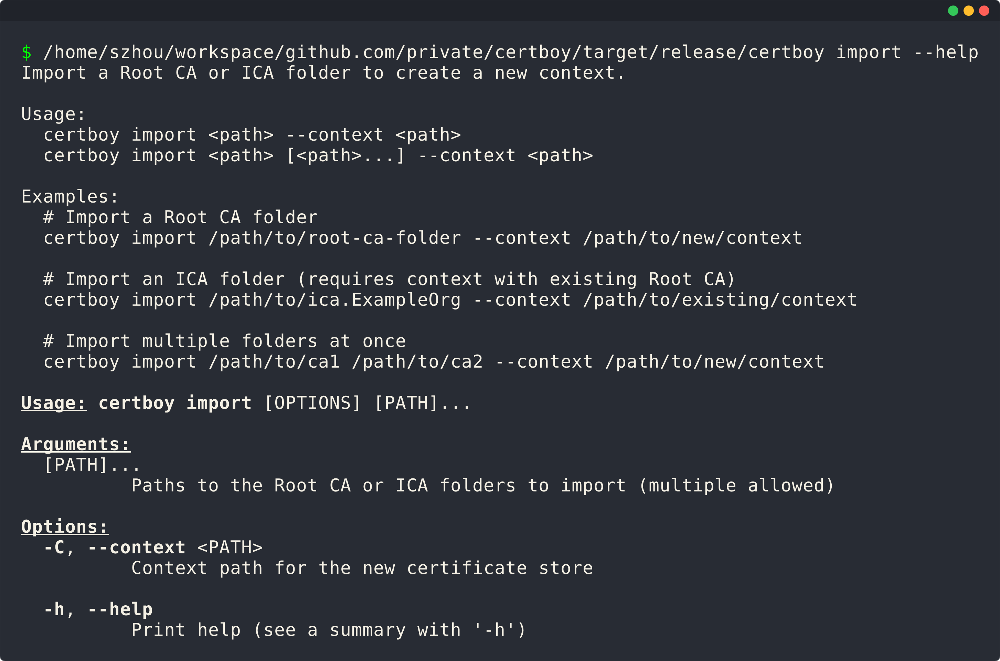
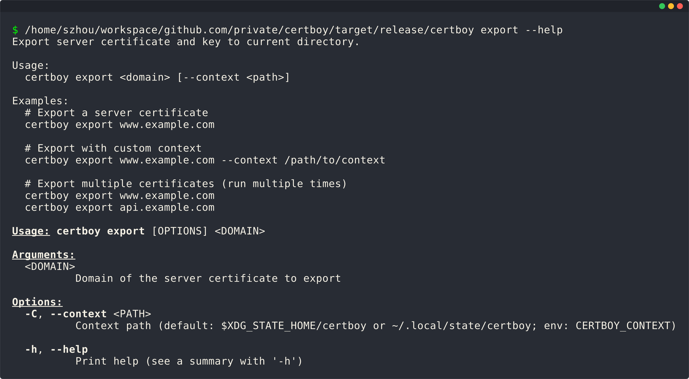
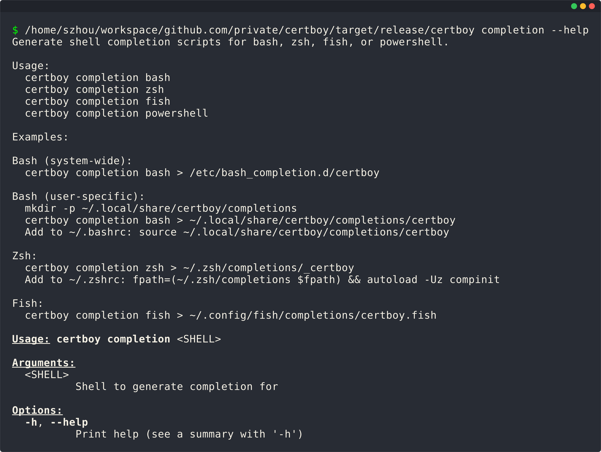
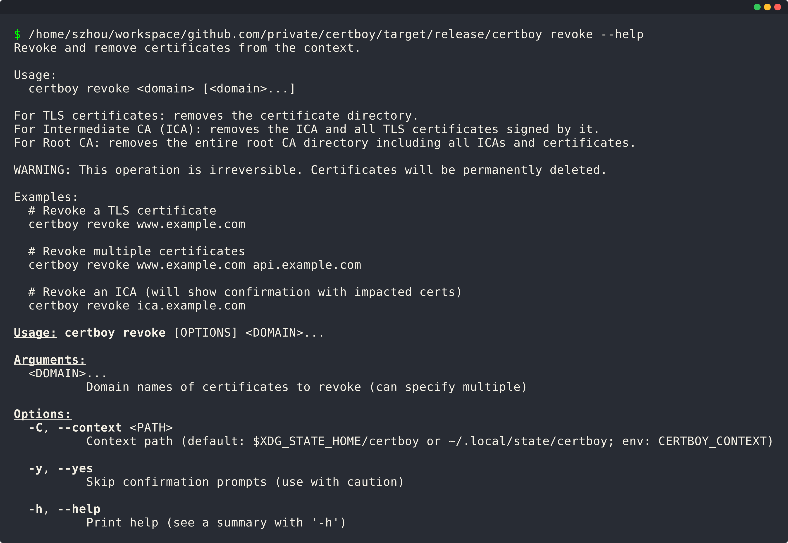

# CLI Reference

Complete reference for all certboy commands, options, and flags.

## Command Overview



## Global Options

These options apply to all commands:

| Option | Short | Description | Default |
|--------|-------|-------------|---------|
| `--domain` | `-d` | Domain name(s) for certificate/CA | |
| `--cn` | | Common Name (required for Root CA and ICA) | |
| `--country` | | Country code | `CN` |
| `--ca` | | Parent CA to sign with | |
| `--root-ca` | | Create a Root CA | false |
| `--force` | `-f` | Force re-sign existing certificate | false |
| `--encrypt-key` | | Encrypt private key with passphrase | false |
| `--key-algorithm` | | Key algorithm (`ecdsa` or `rsa`) | `ecdsa` |
| `--expiration` | `-e` | Expiration in days | varies |
| `--context` | `-C` | Context path | `~/.local/state/certboy` |
| `--verbose` | `-v` | Verbose level (`-v`=info, `-vv`=debug, `-vvv`=trace) | |

## Common Expiration Values

| Days | Years | Use Case |
|------|-------|----------|
| 365 | 1 year | Short-term certificates |
| 730 | 2 years | Standard certificates |
| 1095 | 3 years | TLS certificates (default) |
| 1825 | 5 years | Medium-term CAs |
| 3650 | 10 years | Intermediate CAs (default) |
| 7300 | 20 years | Root CAs (default) |

## Commands

### certboy check

Check certificates in the context.



```bash
certboy check [OPTIONS]
```

**Options:**

| Option | Short | Description | Default |
|--------|-------|-------------|---------|
| `--renew` | `-r` | Renew expiring certificates | false |
| `--expiration-alert` | `-E` | Expiration threshold in days | 14 |
| `--detail` | | Show detailed certificate info | false |
| `--auto-fix` | | Automatically fix issues | false |
| `--yes` | `-y` | Skip confirmation prompts | false |
| `--verify-openssl` | | Verify key/cert match with OpenSSL | false |
| `--remote` | `-R` | Check remote TLS cert against local | false |
| `--context` | `-C` | Context path | default |

**Examples:**

```bash
certboy check
certboy check --detail
certboy check --renew
certboy check --renew --auto-fix --yes
```

### certboy import

Import a Root CA or ICA folder to create a new context.



```bash
certboy import <path> [<path>...] --context <path>
```

**Options:**

| Option | Short | Description | Default |
|--------|-------|-------------|---------|
| `<path>` | | Paths to CA/ICA folders to import | required |
| `--context` | `-C` | Context path for new certificate store | required |

**Examples:**

```bash
certboy import /path/to/root-ca --context /new/context
certboy import /path/to/ca1 /path/to/ca2 --context /new/context
```

### certboy export

Export server certificate and key to current directory.



```bash
certboy export <domain> [--context <path>]
```

**Arguments:**

| Argument | Description | Required |
|----------|-------------|----------|
| `<domain>` | Domain of the server certificate | Yes |

**Options:**

| Option | Short | Description | Default |
|--------|-------|-------------|---------|
| `--context` | `-C` | Context path | default |

**Examples:**

```bash
certboy export www.example.com
certboy export www.example.com --context /path/to/context
```

**Output:**

- `<domain>.crt` - Public certificate
- `<domain>.key` - Private key

### certboy completion

Generate shell completion scripts.



```bash
certboy completion <shell>
```

**Arguments:**

| Argument | Description | Required |
|----------|-------------|----------|
| `<shell>` | Shell type: `bash`, `zsh`, `fish`, `powershell` | Yes |

**Examples:**

```bash
certboy completion bash
certboy completion zsh
certboy completion fish
certboy completion powershell
```

### certboy revoke

Revoke and remove certificates from the context.



```bash
certboy revoke <domain> [<domain>...] [OPTIONS]
```

**Arguments:**

| Argument | Description | Required |
|----------|-------------|----------|
| `<domain>` | Domain name(s) of certificates to revoke | Yes |

**Options:**

| Option | Short | Description | Default |
|--------|-------|-------------|---------|
| `--context` | `-C` | Context path | default |
| `--yes` | `-y` | Skip confirmation | false |

**Examples:**

```bash
certboy revoke www.example.com
certboy revoke www.example.com api.example.com --yes
```

## Usage Patterns

### Create Root CA

```bash
certboy --domain <domain> --cn "<Common Name>" --root-ca [OPTIONS]
```

### Create Intermediate CA

```bash
certboy --domain <domain> --ca <parent-ca> --cn "<Common Name>" [OPTIONS]
```

### Issue TLS Certificate

```bash
certboy --ca <ca> -d <domain> [-d <san>...] [OPTIONS]
```

## Environment Variables

| Variable | Description |
|----------|-------------|
| `CERTBOY_CONTEXT` | Default context path |
| `LOGLEVEL` | Log level (`trace`, `debug`, `info`, `warn`, `error`) |