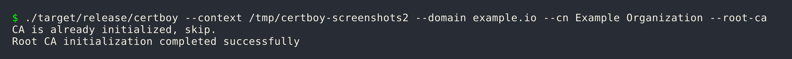
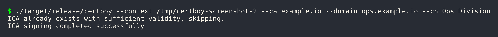
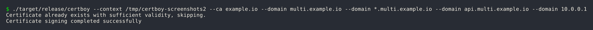
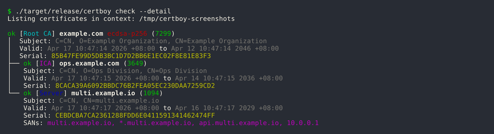

# User Guides

This guide covers all certboy features for managing a local PKI hierarchy: Root CA → Intermediate CA → TLS certificates.

## Table of Contents

1. [Root CA](#root-ca)
2. [Intermediate CA](#intermediate-ca)
3. [TLS Certificates](#tls-certificates)
4. [Check & Renewal](#check--renewal)
5. [Import & Export](#import--export)
6. [Revoke](#revoke)
7. [Shell Completion](#shell-completion)
8. [Context](#context)
9. [Key Algorithm](#key-algorithm)
10. [CLI Reference](#cli-reference)
11. [Develop](#develop)

---

## Root CA

A Root Certificate Authority (CA) is the trust anchor in a PKI hierarchy. It is self-signed and used to sign Intermediate CAs and TLS certificates.

### Create a Root CA

```bash
certboy --domain example.com --cn "Example Organization" --root-ca
```



**Parameters:**

| Flag | Description | Required |
|------|-------------|----------|
| `--domain` | The domain for the Root CA | Yes |
| `--cn` | Common Name for the CA | Yes |
| `--country` | Country code (default: CN) | No |
| `--key-algorithm` | `ecdsa` (default) or `rsa` | No |
| `--expiration` | Expiration in days (default: 7300/20 years) | No |
| `--encrypt-key` | Encrypt private key with passphrase | No |

### Examples

#### Basic Root CA (ECDSA)

```bash
certboy --domain example.com --cn "Example Organization" --root-ca
```

#### Root CA with Different CN and Organization

In enterprise PKI, the Common Name (CN) often differs from the organization name:

```bash
certboy --domain corp.local --cn "Corporate Root CA" --root-ca
```

#### Root CA with RSA

```bash
certboy --domain example.com --cn "Example Organization" --root-ca --key-algorithm rsa
```

#### Root CA with Custom Expiration

```bash
# 10 years (3650 days)
certboy --domain example.com --cn "Example Organization" --root-ca --expiration 3650
```

#### Encrypted Private Key

```bash
certboy --domain example.com --cn "Example Organization" --root-ca --encrypt-key
```

This creates a `pass.key` file containing the passphrase for the encrypted private key.

### Context Structure

After creating a Root CA, the context directory contains:

```
~/.local/state/certboy/
└── example.com/
    ├── meta.json          # CA metadata (algorithm, created date)
    ├── crt.pem            # Public certificate
    ├── key.pem            # Private key (encrypted if --encrypt-key)
    ├── pass.key           # Encryption passphrase (if applicable)
    ├── intermediates.d/   # Intermediate CAs directory
    └── certs.d/           # TLS certificates directory
```

---

## Intermediate CA

An Intermediate CA is a certificate issued by a Root CA, used for delegated certificate signing. This allows you to have multiple signing authorities with different trust policies.

### Create an Intermediate CA

```bash
certboy --domain ops.example.com --ca example.com --cn "Ops Division"
```



**Parameters:**

| Flag | Description | Required |
|------|-------------|----------|
| `--domain` | The domain for the ICA | Yes |
| `--ca` | Parent CA (Root CA or ICA) name | Yes |
| `--cn` | Common Name for the ICA | Yes |
| `--country` | Country code (default: CN) | No |
| `--expiration` | Expiration in days (default: 3650/10 years) | No |

### Domain Ownership Validation

An ICA can only sign certificates within its domain subtree. This is a security feature.

**Example:**

- ICA: `ops.example.com`
- **Allowed:** `ops.example.com`, `grafana.ops.example.com`, `a.b.ops.example.com`
- **Not allowed:** `example.com`, `dev.example.com`, `other.com`

### Examples

#### Basic ICA

```bash
certboy --domain ops.example.com --ca example.com --cn "Ops Division"
```

#### ICA with Different CN and Organization

```bash
certboy --domain engineering.corp.local --ca corp.local --cn "Engineering PKI"
```

#### ICA with Custom Expiration

```bash
# 5 years
certboy --domain services.example.com --ca example.com --cn "Services" --expiration 1825
```

#### Nested ICA (ICA signing ICA)

```bash
# Create a second-level ICA
certboy --domain team.ops.example.com --ca ops.example.com --cn "Team Services"
```

---

## TLS Certificates

TLS certificates (also called server certificates) are end-entity certificates used by websites and services to enable HTTPS.

### Issue a TLS Certificate

```bash
certboy --ca example.com -d www.example.com
```

**Parameters:**

| Flag | Description | Required |
|------|-------------|----------|
| `--ca` | Parent CA (Root CA or ICA) name | Yes |
| `--domain`, `-d` | Domain name(s) for the certificate | Yes |
| `--force` | Force re-sign existing certificate | No |
| `--expiration` | Expiration in days (default: 1095/3 years) | No |
| `--encrypt-key` | Encrypt private key with passphrase | No |

### Examples

#### Single Domain

```bash
certboy --ca example.com -d www.example.com
```

#### Multiple SANs (Subject Alternative Names)

```bash
certboy --ca example.com \
  --domain api.example.com \
  --domain '*.example.com' \
  --domain 192.168.1.100
```

#### Multiple Domains with Wildcard and IP

```bash
certboy --ca example.com \
  --domain multi.example.io \
  --domain '*.multi.example.io' \
  --domain api.multi.example.io \
  --domain 10.0.0.1
```



#### Wildcard Certificate

```bash
certboy --ca example.com -d '*.example.com'
```

#### Force Re-sign

If a certificate already exists and you need to re-issue it:

```bash
certboy --ca example.com -d www.example.com --force
```

#### Encrypted Private Key

```bash
certboy --ca example.com -d www.example.com --encrypt-key
```

### Certificate Chain

TLS certificates issued by an ICA include the full certificate chain in `fullchain.crt`:

```
fullchain.crt
├── TLS certificate (www.example.com)
├── Intermediate CA certificate (ops.example.com)
└── Root CA certificate (example.com)
```

### Expiration

Default expiration periods:

| Certificate Type | Default | Example |
|-----------------|---------|---------|
| Root CA | 7300 days (20 years) | 730 |
| Intermediate CA | 3650 days (10 years) | 1825 |
| TLS Certificate | 1095 days (3 years) | 365 |

---

## Check & Renewal

### Check Certificates

```bash
certboy check
```



Show detailed information including DNS names and IP addresses:

```bash
certboy check --detail
```

### Expiration Alert Threshold

By default, certificates expiring within 14 days are flagged. Customize:

```bash
# 30 day threshold
certboy check --expiration-alert 30
```

### Renew Expiring Certificates

```bash
certboy check --renew
```

This will renew certificates that are:
- Within the expiration alert threshold
- Not yet expired

### Auto-fix

The `--auto-fix` flag detects and fixes common certificate issues:

```bash
# Interactive mode (prompts before each fix)
certboy check --auto-fix

# Automatic mode (applies fixes without prompting)
certboy check --auto-fix --yes
```

Auto-fix can address:
- Wrong `fullchain.crt` order (ICA-signed certificates)
- Duplicate or zero serial numbers
- Certificates needing re-signing due to structural issues

### Verify Certificate Key Match

Verify that the private key matches the certificate using OpenSSL:

```bash
certboy check --verify-openssl
```

### Remote Certificate Check

Compare remote TLS certificate with local:

```bash
certboy check --remote
```

This performs:
1. DNS resolution check with resolved IPs
2. TCP connect to port 443
3. SSL handshake and cert fetch
4. Serial comparison with local certificate

---

## Import & Export

Certboy provides import and export functionality to work with certificates outside the default context.

### Export

Export a TLS certificate and key to the current directory:

```bash
certboy export www.example.com
# Outputs: www.example.com.crt and www.example.com.key
```


### Import

Import an existing Root CA or ICA folder into a new context:

```bash
certboy import /path/to/ca-folder --context /path/to/new-context
```


**Import Requirements:**
- `crt.pem` - Public certificate

### Examples

#### Import a Root CA

```bash
certboy import /path/to/root-ca-example.com --context ~/.local/state/certboy
```

#### Import an ICA

```bash
certboy import /path/to/ica.ops.example.com --context ~/.local/state/certboy
```

#### Import Multiple CAs

```bash
certboy import /path/to/ca1 /path/to/ca2 --context /path/to/context
```

### Use Cases

#### Backup and Restore

```bash
# Export
certboy export www.example.com --context /backup/context

# Import to new location
certboy import /backup/context/example.com --context /new/context
```

#### Migration

```bash
# On old system
certboy export www.example.com

# Copy files to new system, then import
certboy import /path/to/www.example.com --context /new/context
```

#### Consolidation

```bash
certboy import /path/to/ca-a --context /consolidated
certboy import /path/to/ca-b --context /consolidated
```

---

## Revoke

The `revoke` command removes certificates from the context. This operation is **irreversible**.

### Revoke a TLS Certificate

```bash
certboy revoke www.example.com
```


### Revoke Multiple Certificates

```bash
certboy revoke www.example.com api.example.com
```

### Revoke an ICA

When revoking an ICA, all TLS certificates signed by that ICA are affected:

```bash
certboy revoke ops.example.com
```

### Skip Confirmation

```bash
certboy revoke ops.example.com --yes
```

### Revocation Behavior

| Type | What Gets Removed |
|------|-------------------|
| TLS Certificate | The certificate directory |
| Intermediate CA | The ICA and all its signed certificates |
| Root CA | The entire Root CA directory (including all ICAs and certificates) |

### Safety

This operation is **permanent**. Always export certificates before revoking:

```bash
# Export first
certboy export www.example.com

# Then revoke
certboy revoke www.example.com
```

---

## Shell Completion

Certboy can generate shell completion scripts for bash, zsh, fish, and PowerShell.

### Generate Completion

```bash
certboy completion bash
certboy completion zsh
certboy completion fish
certboy completion powershell
```


### Bash

**System-wide:**
```bash
sudo certboy completion bash > /etc/bash_completion.d/certboy
```

**User-specific:**
```bash
mkdir -p ~/.local/share/certboy/completions
certboy completion bash > ~/.local/share/certboy/completions/certboy
```

Add to `~/.bashrc`:
```bash
source ~/.local/share/certboy/completions/certboy
```

### Zsh

```bash
certboy completion zsh > ~/.zsh/completions/_certboy
```

### Fish

```bash
certboy completion fish > ~/.config/fish/completions/certboy.fish
```

### PowerShell

```bash
certboy completion powershell >> $PROFILE
```

---

## Context

A **context** is a directory that stores all certificate authorities and TLS certificates managed by certboy.

### Default Context

```
~/.local/state/certboy/
```

This location is used when:
- No `--context` flag is provided
- No `CERTBOY_CONTEXT` environment variable is set

### Override Context

**Command-line:**
```bash
certboy --context /path/to/context check
```

**Environment Variable:**
```bash
export CERTBOY_CONTEXT=/path/to/context
```

### Directory Structure

```
~/.local/state/certboy/
├── example.com/              # Root CA
│   ├── meta.json
│   ├── crt.pem
│   ├── key.pem
│   ├── intermediates.d/     # Intermediate CAs
│   └── certs.d/             # TLS certificates
└── another.com/             # Another Root CA
```

### Use Cases

**Separate Environments:**
```bash
# Production
certboy --context ~/.local/state/certboy-prod ...

# Development
certboy --context ~/.local/state/certboy-dev ...
```

**Project-specific:**
```bash
certboy --context ./certs --domain example.com --root-ca
```

---

## Key Algorithm

Certboy supports two key algorithms: **ECDSA** and **RSA**.

| Algorithm | Flag Value | Key Size | Default |
|-----------|------------|----------|---------|
| ECDSA P-256 | `ecdsa` | 256-bit | Yes |
| RSA | `rsa` | 2048-bit+ | No |

### Specify Algorithm

```bash
# ECDSA (default)
certboy --domain example.com --cn "Example" --root-ca

# RSA
certboy --domain example.com --cn "Example" --root-ca --key-algorithm rsa
```

### Algorithm Inheritance

All certificates issued under a Root CA **inherit** the same algorithm:

```
Root CA (ECDSA)
├── ICA (inherits ECDSA)
│   └── Certificate (inherits ECDSA)
└── Certificate (inherits ECDSA)
```

### Comparison

| Feature | ECDSA | RSA |
|---------|-------|-----|
| Performance | Faster signing | Slower signing |
| Key Size | Smaller (256-bit) | Larger (2048-bit+) |
| Hardware Token Support | Good | Excellent |

---

## CLI Reference

Complete reference for all certboy commands.


### Global Options

These options apply to all commands:

| Option | Short | Description | Default |
|--------|-------|-------------|---------|
| `--domain` | `-d` | Domain name(s) for certificate/CA | |
| `--cn` | | Common Name (required for Root CA and ICA) | |
| `--ca` | | Parent CA to sign with | |
| `--root-ca` | | Create a Root CA | false |
| `--force` | `-f` | Force re-sign existing certificate | false |
| `--encrypt-key` | | Encrypt private key with passphrase | false |
| `--key-algorithm` | | Key algorithm (`ecdsa` or `rsa`) | `ecdsa` |
| `--expiration` | `-e` | Expiration in days | varies |
| `--context` | `-C` | Context path | `~/.local/state/certboy` |

### Common Expiration Values

| Days | Years | Use Case |
|------|-------|----------|
| 365 | 1 year | Short-term certificates |
| 1095 | 3 years | TLS certificates (default) |
| 1825 | 5 years | Medium-term CAs |
| 3650 | 10 years | Intermediate CAs (default) |
| 7300 | 20 years | Root CAs (default) |

### Environment Variables

| Variable | Description |
|----------|-------------|
| `CERTBOY_CONTEXT` | Default context path |
| `LOGLEVEL` | Log level (`trace`, `debug`, `info`, `warn`, `error`) |

---

## Develop

This page covers local development workflow, testing, and contribution guidelines.

### Quickstart

Clone and build:

```bash
git clone https://github.com/audricsun/certboy.git
cd certboy
cargo build --release
```

Run locally:

```bash
cargo run -- --help
```

### Testing

**Run All Tests:**
```bash
make test
```

**Run Tests Without Coverage:**
```bash
cargo test
```

**Run Clippy (Linting):**
```bash
make clippy
```

**Security Audit:**
```bash
make audit
```

### Makefile Targets

| Target | Description |
|--------|-------------|
| `make help` | Show all available targets |
| `make build` | Build release binary |
| `make check` | Run cargo check |
| `make test` | Run tests with coverage |
| `make clippy` | Run linter |
| `make audit` | Run security audit |
| `make clean` | Clean build artifacts |
| `make doc-dev` | Serve documentation with live reload |
| `make install` | Install via cargo |
| `make musl` | Build musl target |
| `make changelog` | Generate CHANGELOG.md |
| `make bump` | Bump version |

### GitHub Actions

- **ci-tests.yml**: Runs on every push and PR
- **ci-build.yml**: Runs on tag push - builds multi-platform binaries (Linux gnu/musl, Darwin, ARM Linux)
- **ci-publish.yml**: Runs after ci-build completes - creates GitHub Release and publishes to crates.io
- **ci-pages.yml**: Builds and deploys documentation
- **ci-bumpversion.yml**: Auto-bumps version on main branch pushes (dev builds)
- **ci-git-tag.yml**: Creates git tags when VERSION file changes

### Release Workflow

Releases are automated via GitHub Actions:

1. **Version Bump** (automatic): When `VERSION` file changes on main, `ci-bumpversion.yml` bumps the version and commits
2. **Tag Creation**: `ci-git-tag.yml` creates a git tag (`v{version}`) when VERSION changes
3. **Build**: `ci-build.yml` triggers on tag push, building for multiple platforms:
   - `x86_64-unknown-linux-gnu`
   - `x86_64-unknown-linux-musl`
   - `aarch64-apple-darwin`
   - `aarch64-unknown-linux-gnu`
   - `aarch64-unknown-linux-musl`
4. **Publish**: `ci-publish.yml` creates a GitHub Release with all artifacts and publishes to crates.io

**Trigger a Release:**

```bash
# Update VERSION file to release version (removes -devN suffix)
echo "2026.4.1" > VERSION
git add VERSION
git commit -m "release: 2026.4.1"
git push origin main
```

**Version Scheme:**

| Type | Format | Example |
|------|--------|---------|
| Dev build | `YYYY.M.PATCH-devN` | `2026.4.1-dev0`, `2026.4.1-dev1` |
| Release | `YYYY.M.PATCH` | `2026.4.1` |

### Documentation

Serve documentation locally:

```bash
make doc-dev
```

Build docs for production:

```bash
zensical build --clean
```

### Contributing

1. Run `make test` and `make clippy` before submitting PR
2. Ensure all tests pass
3. Update documentation if needed